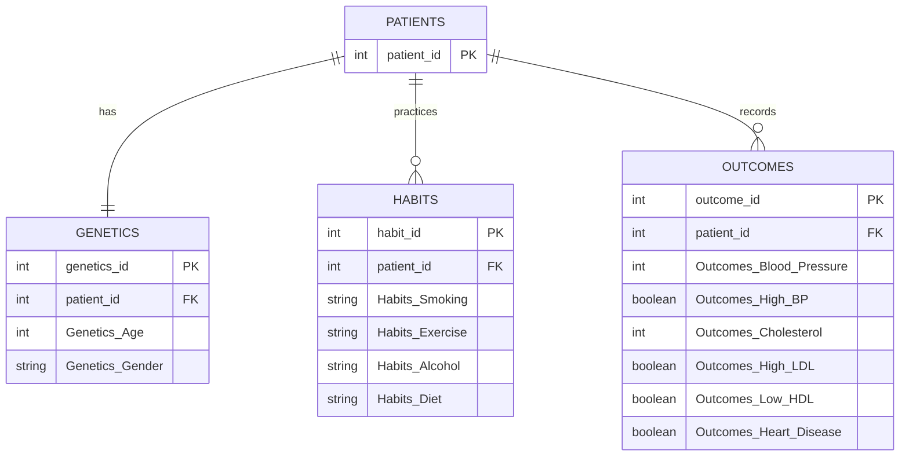

# Project-Title

Heart Health Study

## Data Overview

 Contains first data frame heart_failure: Data that includes age, sex, chest pain, resting blood pressure, cholesterol, fasting blood sugar, resting electrocardiogram results, max heart rate, exercise angina, old peak, the slope of peak exercise, and heart disease.
 Age: age of the patient [years]
Sex: sex of the patient [M: Male, F: Female]
ChestPainType: chest pain type [TA: Typical Angina, ATA: Atypical Angina, NAP: Non-Anginal Pain, ASY: Asymptomatic]
RestingBP: resting blood pressure [mm Hg]
Cholesterol: serum cholesterol [mm/dl]
FastingBS: fasting blood sugar [1: if FastingBS > 120 mg/dl, 0: otherwise]
RestingECG: resting electrocardiogram results [Normal: Normal, ST: having ST-T wave abnormality (T wave inversions and/or ST elevation or depression of > 0.05 mV), LVH: showing probable or definite left ventricular hypertrophy by Estes' criteria]
MaxHR: maximum heart rate achieved [Numeric value between 60 and 202]
ExerciseAngina: exercise-induced angina [Y: Yes, N: No]
Oldpeak: oldpeak = ST [Numeric value measured in depression]
ST_Slope: the slope of the peak exercise ST segment [Up: upsloping, Flat: flat, Down: downsloping]
HeartDisease: output class [1: heart disease, 0: Normal]
 Columns  of second dataframe-heart_disease;
Age: The individual's age.
Gender: The individual's gender (Male or Female).
Blood Pressure: The individual's blood pressure (systolic).
Cholesterol Level: The individual's total cholesterol level.
Exercise Habits: The individual's exercise habits (Low, Medium, High).
Smoking: Whether the individual smokes or not (Yes or No).
Family Heart Disease: Whether there is a family history of heart disease (Yes or No).
Diabetes: Whether the individual has diabetes (Yes or No).
BMI: The individual's body mass index.
High Blood Pressure: Whether the individual has high blood pressure (Yes or No).
Low HDL Cholesterol: Whether the individual has low HDL cholesterol (Yes or No).
High LDL Cholesterol: Whether the individual has high LDL cholesterol (Yes or No).
Alcohol Consumption: The individual's alcohol consumption level (None, Low, Medium, High).
Stress Level: The individual's stress level (Low, Medium, High).
Sleep Hours: The number of hours the individual sleeps.
Sugar Consumption: The individual's sugar consumption level (Low, Medium, High).
Triglyceride Level: The individual's triglyceride level.
Fasting Blood Sugar: The individual's fasting blood sugar level.
CRP Level: The C-reactive protein level (a marker of inflammation).
Homocysteine Level: The individual's homocysteine level (an amino acid that affects blood vessel health).
Heart Disease Status: The individual's heart disease status (Yes or No).
## Database Schema (ERD)

## How to use

import pandas as pd, data = pd.read_csv('../Data/heart.csv') , ('../Data/heart_disease.csv')

## Source used

Datasets used from: Kaggle
heart_failure(https://www.kaggle.com/datasets/fedesoriano/heart-failure-prediction), heart_disease(https://www.kaggle.com/datasets/oktayrdeki/heart-disease)

I used AI to research, specifically utilizing
Google Gemini and Mirosoft Copilot as an educator enhancer.
